# DDD (Domain-Driven-Design) ile Goal Management System Uygulaması

Domain driven design kullanarak oluşturulmuş olan *Goal Management System* implementasyonunu içeren örnek uygulamadır.

## İçindekiler

- [Kullanılan Teknolojiler](#kullanılan-teknolojiler)
- [Projenin Çalıştırılması](#projenin-çalıştırılması)
- [Proje Mimarisi](#proje-mimarisi)
- [Eventstorming Diagram](#eventstorming-diagram)
- [Strategic Design](#strategic-design)
  - [Identity Management](#identity-management)
  - [Organisation](#organisation)
  - [Goal Management](#goal-management)
  - [Performance Evaluation](#performance-evaluation)
  - [Notification](#notification)
- [Tactical Design](#tactical-design)
  - [Organisation](#organisation-1)
  - [Goal Management](#goal-management-1)
  - [Performance Evaluation](#performance-evaluation-1)
- [Ekran Görüntüleri](#ekran-görüntüleri)
- [Kaynaklar](#kaynaklar)
    - [Kitaplar](#kitaplar)
    - [Örnek Projeler](#örnek-projeler)

## Kullanılan Teknolojiler

Bu proje aşağıdaki teknolojileri kullanmaktadır:

- **.NET 9**: Uygulamanın temel framework'ü.
- **Entity Framework Core**: Veri erişim katmanı için ORM.
- **Docker**: Uygulamanın konteynerize edilmesi ve çalıştırılması.
- **SQL Server**: Veritabanı yönetim sistemi.
- **Asp.Net Core Identity**: Kimlik doğrulama ve yetkilendirme.
- **MediatR**: CQRS ve mediator pattern implementasyonu.
- **FluentValidation**: Veri doğrulama.
- **xUnit**: Birim testleri için test framework'ü.
- **Mail Server**: E-posta gönderimi için kullanılan sunucu.

## Projenin Çalıştırılması

Projeyi çalıştırmak için aşağıdaki adımları izleyin:

1. **Gereksinimler**:
   - .NET 9 SDK
   - Docker ve Docker Compose
   - SQL Server (Docker ile birlikte çalıştırılabilir)

2. **Depoyu Klonlayın**:
   ```bash
   git clone <repository-url>
   cd goal-management-system
   ```

3. **Docker ile Çalıştırma**:
   - Docker Compose kullanarak tüm servisleri başlatın:
     ```bash
     docker-compose up --build
     ```
   - Uygulama varsayılan olarak `http://localhost:8080` adresinde çalışacaktır.

4. **Manuel Çalıştırma**:
   - Veritabanını başlatın (örneğin, Docker ile SQL Server çalıştırabilirsiniz):
     ```bash
     docker run -e 'ACCEPT_EULA=Y' -e 'SA_PASSWORD=Your_password123' -p 1433:1433 -d mcr.microsoft.com/mssql/server:2019-latest
     ```
   - `GoalManager.sln` dosyasını Visual Studio ile açın.
   - `GoalManager.Web` projesini başlatın.

5. **Testlerin Çalıştırılması**:
   - Test projelerini çalıştırmak için aşağıdaki komutu kullanabilirsiniz:
     ```bash
     dotnet test
     ```

6. **Mail Server'ın Çalıştırılması**:
   - Mail server için Docker Compose kullanarak aşağıdaki komutla başlatabilirsiniz:
     ```bash
     docker-compose up mailserver
     ```
   - Mail server varsayılan olarak `http://localhost:37409` adresinde çalışacaktır.

Bu adımları takip ederek projeyi çalıştırabilir ve geliştirme ortamında test edebilirsiniz.

## Proje Mimarisi

Projede Clean Architecture mimarisi kullanılmıştır. Clean Architecture `Business Domain`'i uygulamanın merkezine yerleştirir. `Infrastructure`, `UI` gibi katmanlar `Business Domain` ve `Application` katmanlarına bağımlıdır.

Aşağıdaki diagramda Clean Architecture'ın tanımlamış olduğu katmanlar gösterilmiştir.

- En merkezde Business Domain'i içeren `Entities` katmanı bulunmaktadır.
- Bir üst katmanda Application kurallarını içeren `Use Cases` katmanı vardır.
- Onun bir üstünde dış sistemler (UI, External API vs.) ile Core Business (Use Cases, Entities) veri akışını düzenleyen `Interface Adapters` katmanı bulunmaktadır.
- En üst katmanda da veri tabanı, email provider, ui frameworkler, apiler gibi dış sistemler ve infrastructure elementlerini içeren `Framework & Drivers` katmanı bulunmaktadır.

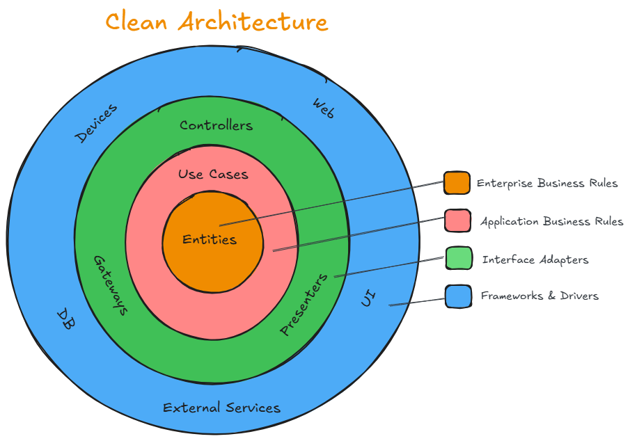

İç katmanlardan dış katmanlardaki implementasyonlara doğrudan erişilemez. Bunun yerine iç katmanlar, iç katmanda yaratılmış Interface'lere erişir, Interface'leri de dış katmanlar implemente eder. Böylece iç katman, dış katmanın implementasyonuna değil, Interface'ine bağımlıdır (Dependency Inversion).

Goal Manager DDD projes [ardalis/cleanarchitecture](https://github.com/ardalis/cleanarchitecture) template'ini kullanmaktadır. Projenin bağımlılık diagramı aşağıdaki gibidir.

- *Entities Katmanı*: GoalManager.Core
- *Use Cases Katmanı*: GoalManager.UseCases
- *Frameworks & Drivers Katmanı*: GoalManager.Web ve GoalManager.Infrastructure

> Not: Ardalis clean architecture template'inde *Interface Adapters* şeklinde açıkça adlandırılan bir katman yoktur. Ancak bu katmanın işlevini gören, core application ile dış servisler (UI, DB, API vs) arasındaki veri dönüşümünü sağlayan yapılar Infrastructure, Web, Use Cases katmanlarının içerisinde mevcuttur.


Uygulamanın Domain Driven Design kısmı `GoalManager.Core` ve `GoalManager.UseCases` projelerini kapsamaktadır.

GoalManager.UseCases

- Application Services

GoalManager.Core

- Entities
- Aggregates
- Value Objects
- Domain Events
- Domain Services

## Eventstorming Diagram

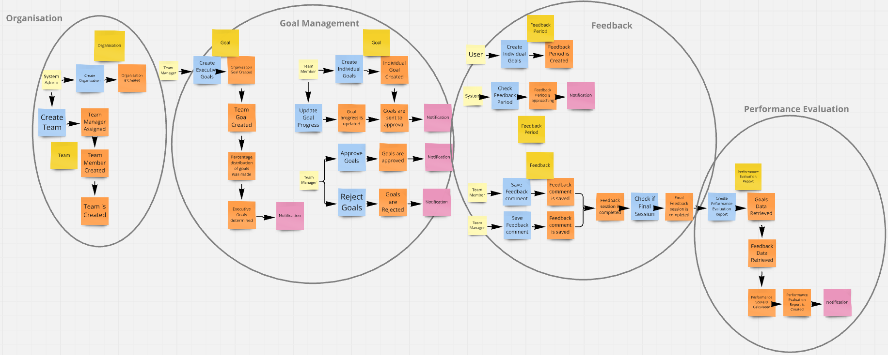

## Strategic Design

### Diagram

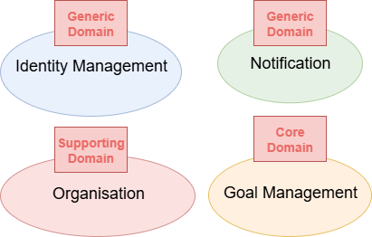

### Identity Management

Authentication, authorization ve kullanıcı profili yönetimi işlemlerini yapar. Goal Management sistemine özel bir business domain'i olmadığı için generic sub-domain olarak değerlendirildi. Identity Management işlevini gerçekleştirebilecek piyasada birçok hazır çözüm mevcuttur ve Identity Management sub-domain'i, Goal Management sistemi içerisinde değerlendirdiğimizde rakip ürünlere karşı rekabetçi avantaj sağlama gibi bir özelliği bulunmamaktadır.

Asp.Net Core Identity kütüphanesi kullanılmıştır. Identity Management sayfaları da Identity Scaffolder ile üretilmiştir. Çok karmaşık iş kuralları barındırmadığı ve generic sub-domain olduğu için DDD kullanılmadan geliştirilmiştir.

### Organisation

Organizasyonlar, takımlar, takım üyeleri ve takım sorumluluklarının atanması gibi organizasyonel işler burada yönetilmektedir.

Ana amacı Goal Management ve Performance Evaluation core domain'lerini destekleyecek yapıyı sağlamaktadır. Goal management uygulamasının ana odağı değildir. Bu nedenlerden dolayı supporting sub-domain olarak değerlendirilmiştir.

### Goal Management

Goal management uygulamasının ana hedefini gerçekleştirmektedir. Hedef tanımlarını, izler ve yönetir. Kullanıcıların veya organizasyonların hedeflerini yönetmelerine ve hedeflerine ulaşmalarına yardımcı olmaktadır. Uygulamayı rakiplerden farklılaştırdığı ve rekabet avantajı sağladığı için core sub-domain olarak değerlendirilmiştir.

Not: Goal Management ve Performance Evaluation bounded context'lerini içermektedir.

### Notification

Goal Management uygulamasının, hatırlatıcılar ve güncelleme gibi bildirimleri gönderen parçasıdır. Goal Management sistemine özgü bir yapı değildir. Bir çok uygulamada yer alan ve yardımcı programlar ya da harici kütüphaneler ile işlevini gerçekleştirebilen bir yapı olduğu için generic sub-domain olarak değerlendirildi.

## Tactical Design

### Organisation

Organisation bounded context'i içerisinde Organisation aggregate root nesnesi bulunmaktadır. `Organisation` içerisinde `Team` listesi. Team listesinin altında da `TeamMember` listesi bulunmaktadır.

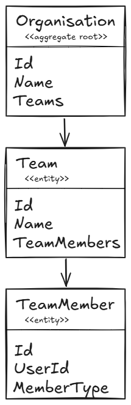

Organisation aggregate root için geçerli olan önemli iş kuralları aşağıdaki gibidir;

- Organizasyon adı zorunludur.
- Organizasyon adı unique'dir.
- Takım adı zorunludur.
- Bir organizasyonun altındaki takımların adları unique olmalıdır.
- Bir organisayonun altında en fazla 5 takım olabilir.
- Bir takımda en fazla 10 takım üyesi olabilir.
- Bir takımda en fazla 1 tane takım lideri olabilir.

### Goal Management

Goal Management bounded context'i içerisinde hedef dönemleri ve takım üyeleri hedeflerini yönetmemize yardımcı olacak `GoalPeriod` ve `GoalSet` aggregate root nesnelerini içermektedir. Class Diyagramı ve bounded context'in elemanları aşağıda listelenmektedir.

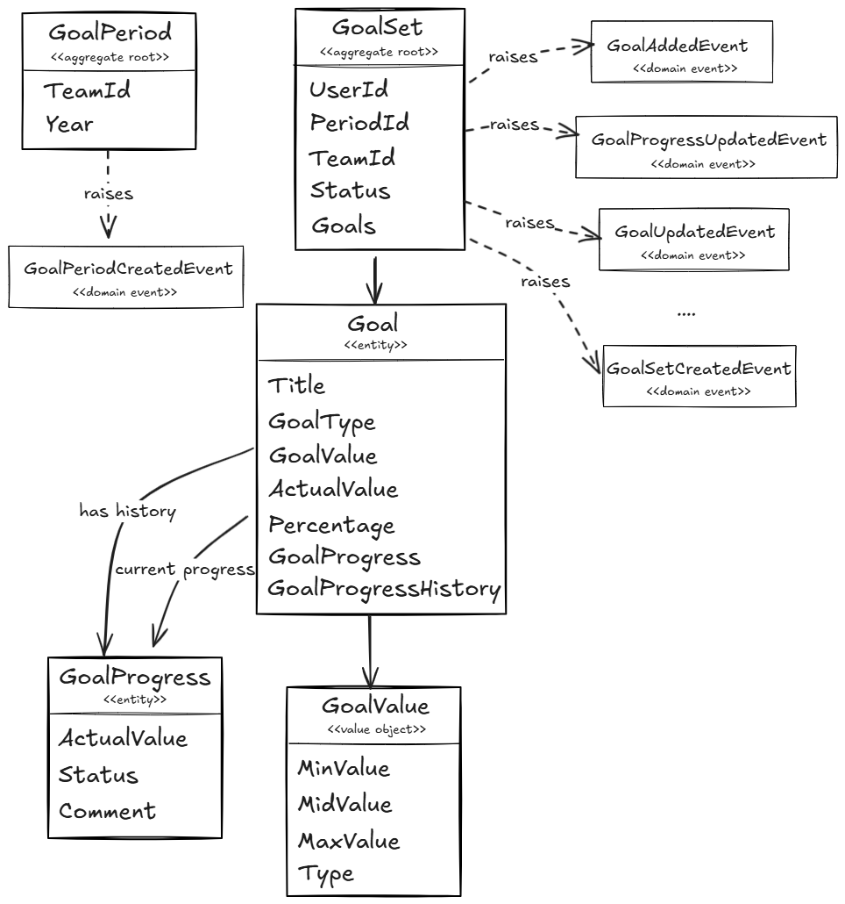

#### Aggregate Roots

- **GoalSet:** Takım üyesi hedefleri ve hedeflerin yaşam döngüsünün yönetildiği aggregate root nesnesi.
- **GoalPeriod:** Takım hedef dönemlerinin yönetildiği aggregate root nestnesi.

#### Entities

- **Goal:** GoalSet'e bağlı hedef bilgilerinin yönetildiği entity nesnesi.
- **GoalProgress:** Hedeflerin ilerlemesinin ve ilerleme tarihçesinin yönetildiği entity nesnesi.

#### Value Objects

- **GoalValue:** Hedefin min, mid, max değerler ve hedef tipinin tutulduğu value object sınıfı.

#### Domain Events

- GoalAddedEvent
- GoalPeriodCreatedEvent
- GoalProgressApprovedEvent
- GoalProgressRejectedEvent
- GoalProgressUpdatedEvent
- GoalSetApprovedEvent
- GoalSetCreatedEvent
- GoalSetRejectedEvent
- GoalSetSentToApprovalEvent
- GoalUpdatedEvent

#### İş Kuralları ve Invariant'lar

- Bir GoalSet altında en fazla 10 hedef olabilir
- Hedeflerin toplam yüzdes 100% olmalıdır
- Hedef değerleri girerken belirlenen min, mid, max birbiriyle tutarlı olmalı (min < mid < max)
- Hedef ilerleme kaydı onay iş akışı
- Statü bazlı iş akışı kontrolleri

### Performance Evaluation

Performance Evaluation bounded context'i içerisinde takım üyelerinin dönem sonu performans raporlarının oluşturulup yönetildiği nesneleri içermektedir. Class Diyagramı ve bounded context'in elemanları aşağıda listelenmektedir.

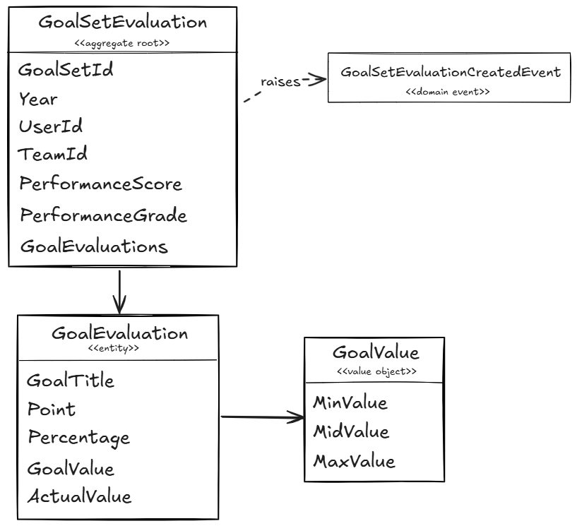

#### Aggregate Roots

- **GoalSetEvaluation:** Takım üyesi performans raporunun yönetildiği aggregate root nesnesi.

#### Entities

- **GoalEvaluation:** Hedef bilgileri ve puanlarının tutulduğu entity nesnesi.

#### Value Objects

- **GoalValue:** Hedefin min, mid, max değerlerinin tutulduğu value object sınıfı.

#### Domain Events

- GoalSetEvaluationCreatedEvent

#### Performans Hesaplama Algoritması

goal_point:

- < min: 0 points
- = min: 60 points
- \> min ve < mid: 60 to 80 points
- = mid: 80 points
- \> mid ve < max: 80 to 100 points
- ≥ max: 100 points

performance_score = Σ(goal_point × goal_percentage / 100)

## Ekran Görüntüleri

Uygulamanın uçtan uca iş akışlarını (organizasyon tanımı, takım & üye yönetimi, hedef belirleme, ilerleme/onay süreci ve performans değerlendirme) gösteren ekran görüntüleri. Her bir adım ilgili bounded context ve domain kurallarıyla ilişkilendirilmiştir.

### 001 - Organizasyon Oluşturma
Organizasyonun ilk tanımlandığı form. Zorunlu ve unique organizasyon adı validasyonu burada tetiklenir; Organizasyon aggregate root başlangıç durumu.

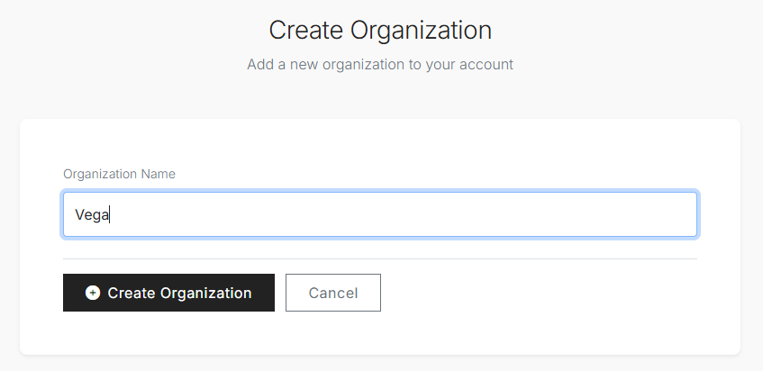

### 002 - Organizasyon Listesi
Kullanıcının erişebildiği organizasyon kayıtlarını gösterir. Supporting sub-domain içindeki sorgu (query) tarafı örneği.

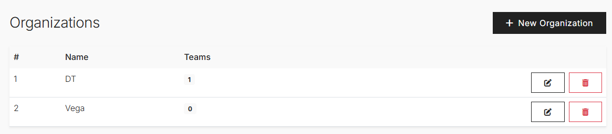

### 003 - Organizasyon Güncelleme
Var olan organizasyon üzerinde isim değişikliği (unique constraint korunarak) ve hiyerarşiye etki eden alanların yönetimi.

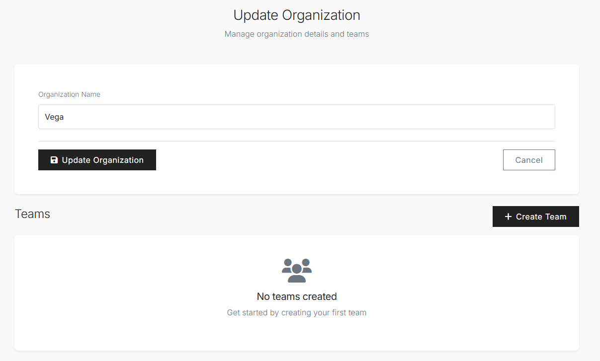

### 004 - Takım Oluşturma
Organizasyon altına yeni takım eklenir; bir organizasyon altında en fazla 5 takım iş kuralı kontrolü tetiklenir.

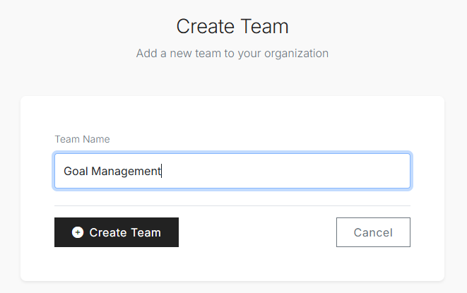

### 005 - Takım Listesi
Seçilen organizasyon altındaki mevcut takımların listesi, Takım görünümü.

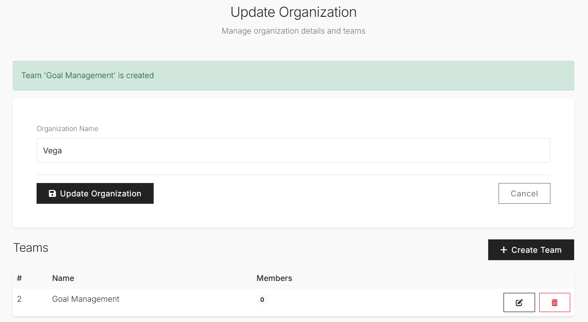

### 006 - Takım Güncelleme
Takım adı uniqueness kuralı ve takım lideri atama/güncelleme işlemleri.

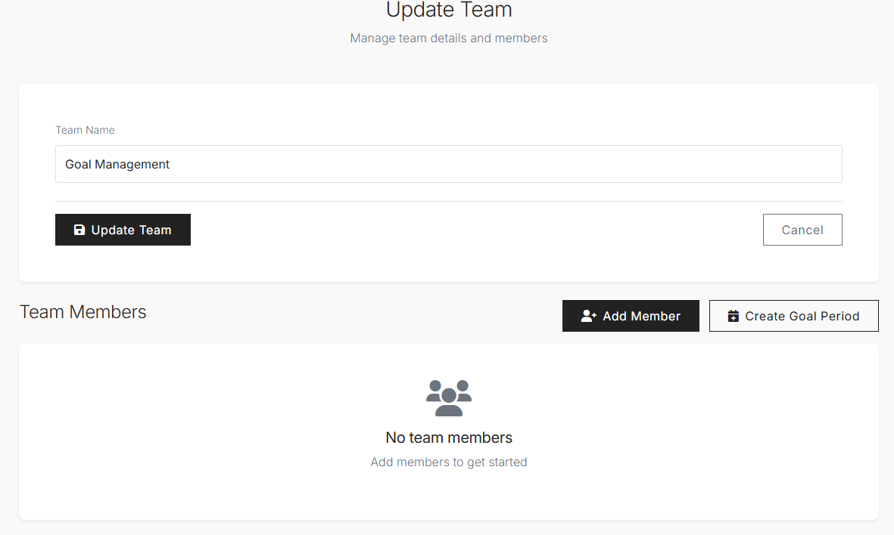

### 007 - Takım Üyesi Ekleme
Takıma üye eklerken maksimum 10 üye ve en fazla 1 lider iş kuralları kontrol edilir.

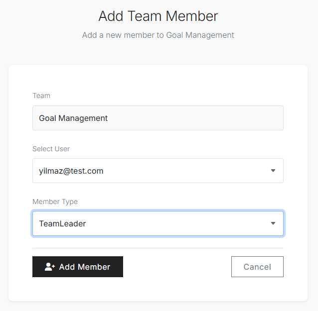

### 008 - Takım Üyesi Listesi
Takım üyesi izlenmesi; domain içinde aggregate sınırı dışına taşmadan okumalar.

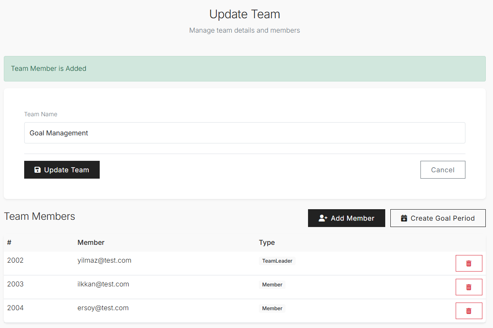

### 009 - Kullanıcının Takımları ve Hedefleri
Kullanıcının ait olduğu takımlar ve ilişkili hedef setlerine geçiş noktası. Hedef Yönetimi bounded context'ine giriş.

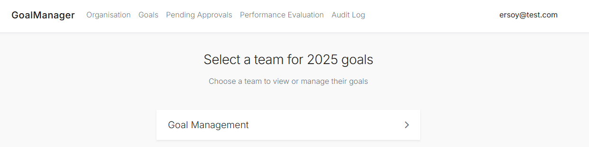

### 010 - Boş HedefSet Ekranı
Dönem için henüz hedef tanımlanmamış durumda başlangıç görünümü; Hedef Kümesi yaşam döngüsü başlangıcı (Taslak durumu).

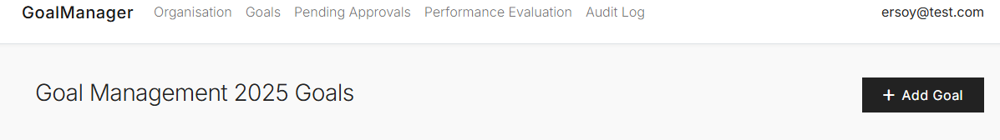

### 011 - Yeni Hedef Ekleme Formu
Hedef entity oluşturma; yüzde (percentage) henüz toplamda 100 zorunluluğuna ulaşmamış olabilir, min/mid/max tutarlılık validasyonu.

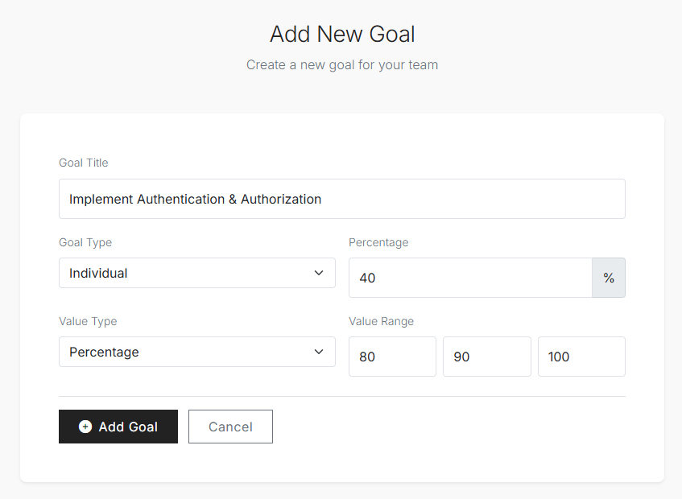

### 012 - Kullanıcının Hedef Listesi
Hedef Kümesi altındaki tüm hedefler; toplam yüzde 100 kuralının görsel geri bildirimi.

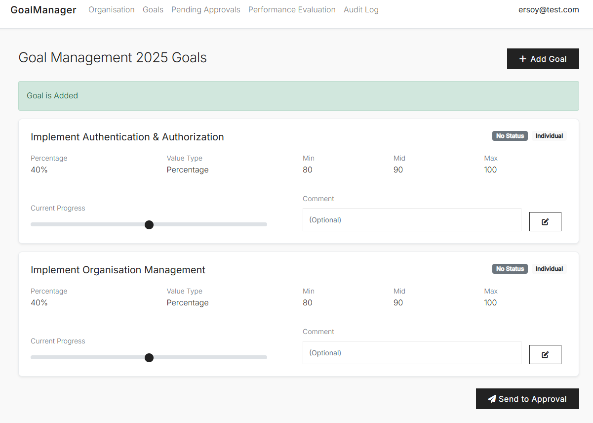

### 013 - Hedef İlerleme Durumunu Onaya Gönderme
Hedef ilerleme durumu güncellemesi sonrası onay workflow tetikleme; HedefProgressUpdatedEvent ve ardından onaya gönderim isteği.

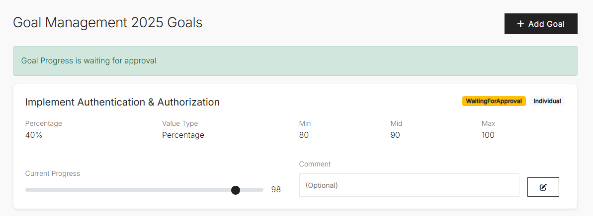

### 014 - Bekleyen Hedef İlerleme Durumu Onayları
Takım lideri için pending durumundaki ilerleme kayıtları; statü bazlı filtreleme.

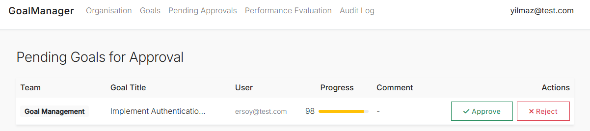

### 015a - Hedef Kümesi Onay Bekliyor
Kullanıcının göndermiş olduğu Hedef Kümesi için waiting/under review durumu; HedefSetSentToApprovalEvent tetiklenmiş.

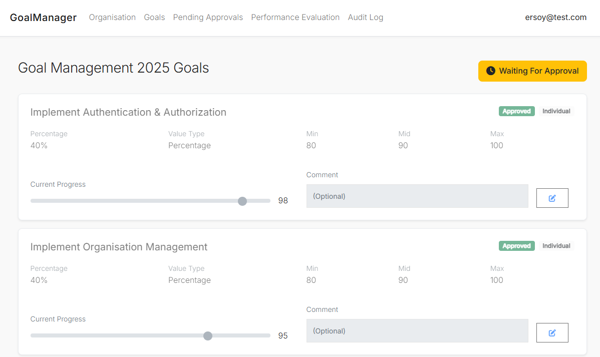

### 015b - Onaylanacak Hedef Kümesi Listesi
Yönetici/takım lideri için pending Hedef Kümesi koleksiyonu; iş akışında toplu inceleme girişi.

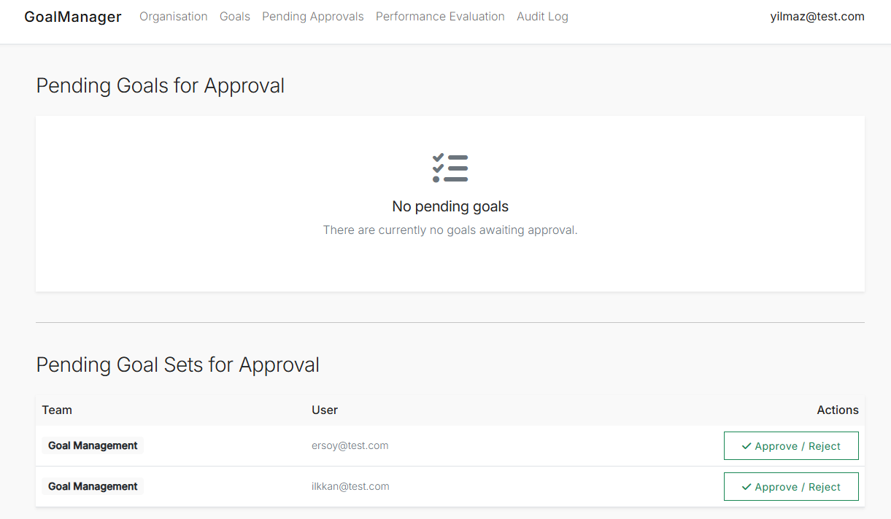

### 016 - Hedef Kümesi Onay / Red İşlemi
HedefSetApprovedEvent veya HedefSetRejectedEvent üretir; statü geçiş kontrolleri uygulanır.

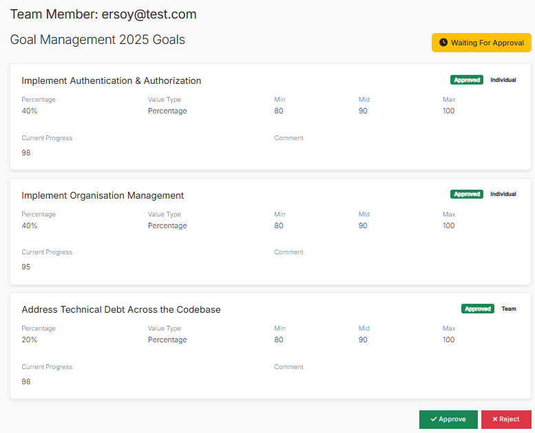

### 017 - Performans Değerlendirme Hesaplama Başlatma
HedefSetEvaluation aggregate oluşturulur; her hedef için hedef puanı hesaplamaya hazırlık.

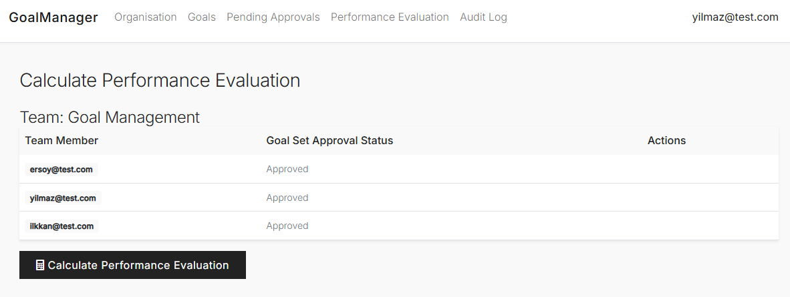

### 018 - Performans Değerlendirme Hesaplama Tamamlandı
Hedef bazlı puanların hesaplanması ve aggregate içi tutarlılık (toplam yüzdelerin etkisi) doğrulandı.

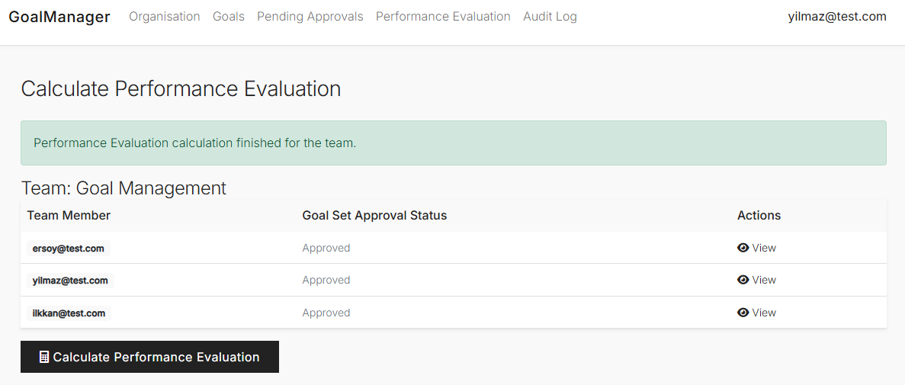

### 019 - Performans Raporu
Hesaplanmış performance_score ve hedef bazlı katkıların şeffaf gösterimi; formül (Σ(goal_point × goal_percentage/100)) açıklanır.

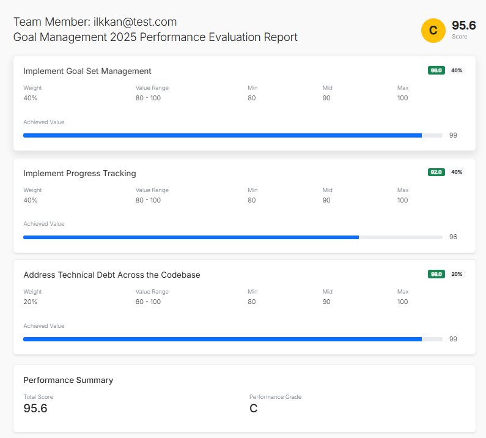

## Kaynaklar

### Kitaplar

- Domain-Driven Design: Tackling Complexity in the Heart of Software (Eric Evans)
- Implementing Domain-Driven Design (Vaughn Vernon)
- Learning Domain-Driven Design: Aligning Software Architecture and Business Strategy (Vlad Khononov)

### Örnek Projeler

- <https://github.com/dotnet-architecture/eShopOnWeb>
- <https://github.com/ardalis/ddd-vet-sample>
- <https://github.com/ardalis/ddd-guestbook>
- <https://github.com/m-jovanovic/event-reminder>
- <https://github.com/m-jovanovic/rally-simulator>
- <https://github.com/EnLabSoftware/HRManagement>