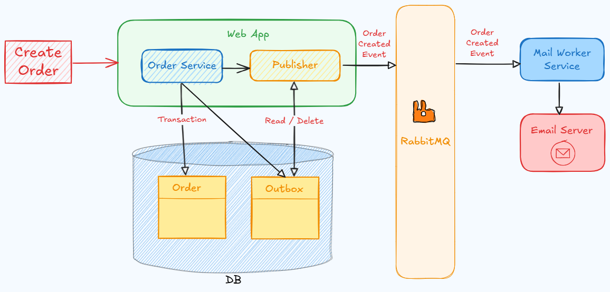

# Transactional Outbox Pattern

Transactional outbox pattern'i kullanımı hakkında uygulama örneği.

## Outbox pattern nedir?
- Mikroservislerin hem veritabanına yazıp hem de mesaj kuyruğuna güvenilir şekilde mesaj yayınlaması için kullanılan bir desendir.
- Veritabanı transactionı kullanılarak hem domain verisi hem de mesaj kuyruğuna eklenecek event kaydı ("outbox" tablosuna) aynı veritabanına kaydedilir. Böylece mesaj kuyruğuna çift-yazma (dual-write) problemi ortadan kalkar.
- Ayrı bir arka plan işlemcisi outbox tablosunu periyodik olarak tarar, mesaj kuyruğuna (ör. RabbitMQ) yayınlar, başarılı olursa kaydı işlendi (processed) olarak işaretler.
- Avantajlar: atomiklik, en az bir kez teslimat (at-least-once).

### Örnek: Dual-write problemi nasıl oluşur ve Outbox nasıl çözer?
- Senaryo: Sipariş oluşturulduğunda "OrderCreated" eventi yayınlanacak ve e-posta gönderilecek.
- Outbox OLMADAN (iki ayrı yazma):
  1) Orders tablosuna INSERT -> COMMIT
  2) RabbitMQ'ya "OrderCreated" publish
  - Eğer 2. adım ağ hatasıyla başarısız olursa: DB'de sipariş var ama olay yayınlanmadı; diğer servisler habersiz, e-posta gitmez.
  - Tersi durumda: Publish başarılı, fakat DB COMMIT başarısız olursa; diğer servislerde hayalet (olmayan) sipariş görülür.
- Outbox İLE (tek transaction):
  1) Aynı DB transaction'ında: Orders INSERT + Outbox tablosuna "OrderCreated" event kaydı.
  2) Transaction COMMIT edilince her iki kayıt da garanti altına alınır. Sonrasında outbox'tan event alınır, RabbitMQ'ya yayınlanır; başarılıysa outboxta kaydı işlendi olarak işaretler.
  - Sonuç: Ya ikisi birlikte commit olur ya da hiçbiri; eventin yayınlanması en az bir kez garanti edilir. (at-least-once)

## Diyagramdaki bileşenler

- `TransactionalOutboxPatternApp` (ASP.NET Core): HTTP isteklerini alır, iş kuralı verisini ve outbox kaydını aynı SQL transactionında yazar.
- `Publisher` Outbox tablosunu tarar, gönderilmemiş kayıtları RabbitMQ'ya yayınlar; başarılı yayından sonra kaydı "Processed" olarak işaretler.
- `MSSQL` (1433): `Order` tablosu + `Outbox` tablosu.
- `RabbitMQ` (5672, yönetim 15672): Olay/mesajların yayınlandığı mesaj aracısı.
- `MailWorkerService`: RabbitMQ'dan ilgili kuyruğu/konuyu dinler, mesajı işler (ör. e-posta gönderimi), idempotent olacak şekilde ACK/NACK yönetir.
- `Papercut Mail Server` (37409→37408): Geliştirici dostu SMTP sunucusu; işlenen e-postaları görsellemek için kullanılır.
