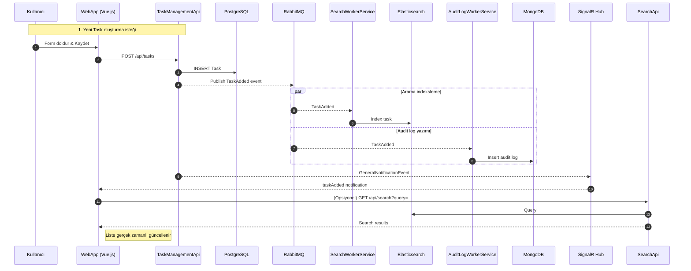

# Todo Microservice

Todo Microservice projesi web uygulaması üzerinden task *ekleme*, *silme*, *listeleme*, *filtreleme* ve *arama* yapabildiğimiz *mikroservis mimarisi* ile geliştirilmiş bir örnek uygulamadır.

## İçindekiler

- [Projeyi Çalıştırma](#projeyi-çalıştırma)
- [Erişim Noktaları (Varsayılan Portlar)](#erişim-noktaları-varsayılan-portlar)
- [Konfigürasyon / Ortam Değişkenleri](#konfigürasyon--ortam-değişkenleri)
- [Kullanılan Teknolojiler](#kullanılan-teknolojiler)
- [Ekran Görüntüsü (Todo Web App)](#ekran-görüntüsü-todo-web-app)
- [Mimari](#mimari)
- [Event Akışı (Örnek Senaryo)](#event-akışı-örnek-senaryo)
  - [Diyagram (Mermaid)](#diyagram-mermaid)
- [Gelecek Geliştirme Fikirleri](#gelecek-geliştirme-fikirleri)

## Projeyi Çalıştırma

Gereksinimler:

- .NET 9 SDK
- Docker ve Docker Compose

Komut (PowerShell / Windows):

```powershell
docker compose up -d --build
```

İlk çalıştırmada imajlar indirilecek ve container'lar ayağa kalkacaktır.

Logları izlemek için:

```powershell
docker compose logs -f taskmanagementapi
```

Durdurmak için:

```powershell
docker compose down
```

Verileri de silmek isterseniz (named volume'ları kaldırır):

```powershell
docker compose down -v
```

## Erişim Noktaları (Varsayılan Portlar)

- Web Uygulaması: [http://localhost:8084](http://localhost:8084)
- TaskManagementApi: [http://localhost:8081/swagger](http://localhost:8081/swagger)
- SearchApi: [http://localhost:8082/swagger](http://localhost:8082/swagger)
- AuditLogApi: [http://localhost:8083/swagger](http://localhost:8083/swagger)
- Envoy Gateway: [http://localhost:10000](http://localhost:10000) (örn. [http://localhost:10000/task-management/swagger](http://localhost:10000/task-management/swagger))
- RabbitMQ Yönetim Konsolu: [http://localhost:15672](http://localhost:15672) (guest / guest)
- PostgreSQL: localhost:5432
- Elasticsearch: [http://localhost:9200](http://localhost:9200)
- MongoDB: localhost:27017
- MongoClient UI: [http://localhost:3000](http://localhost:3000)

## Konfigürasyon / Ortam Değişkenleri

Örnek bazı ayarlar (docker-compose ve appsettings üzerinden):

- PostgreSQL: POSTGRES_DB, POSTGRES_USER, POSTGRES_PASSWORD
- RabbitMQ: Host, UserName, Password (appsettings.json)
- MongoDB: admin / Password1 (connection string appsettings)
- Elasticsearch: ELASTIC_PASSWORD (gerektiğinde security)

## Kullanılan Teknolojiler

- .NET 9 / ASP.NET Core Web API (TaskManagementApi, SearchApi, AuditLogApi)
- .NET 9 Worker Service (SearchWorkerService, AuditLogWorkerService)
- Entity Framework Core + PostgreSQL (Task verileri için)
- RabbitMQ (Event / Message Queue)
- Elasticsearch (Full‑text arama & filtreleme için indeks)
- MongoDB (Audit / denetim logları)
- SignalR (Gerçek zamanlı bildirimler – General Notification Hub)
- Envoy Proxy (API Gateway & Reverse Proxy, path rewrite + swagger erişimi)
- Vue.js 3 + TypeScript (TodoWebApp)
- Docker & Docker Compose (Yerel orkestrasyon)
- NEST (Elasticsearch .NET client)
- OpenAPI / Swagger (Dokümantasyon)

## Ekran Görüntüsü (Todo Web App)


## Mimari


Aşağıda mimari diyagramdaki ana komponentler özetlenmiştir:

### 1. Web Uygulaması (TodoWebApp)

Vue.js tabanlı SPA. Envoy veya direkt servis endpoint’leri üzerinden API çağrıları yapar. SignalR hub (TaskManagementApi) ile gerçek zamanlı güncellemeleri alır.

### 2. Envoy (API Gateway)

İstekleri ilgili mikroservislere yönlendirir ve path rewrite işlemlerini yapar.

- /task-management/*  -> TaskManagementApi
- /task-search/*       -> SearchApi

### 3. TaskManagementApi

Görev CRUD operasyonlarını, durum değiştirmeyi ve temel filtrelemeleri sağlar. PostgreSQL üzerinde TaskDbContext ile veriyi tutar. Her değişiklikte ilgili domain event’lerini RabbitMQ’ya yayınlar. SignalR üzerinden istemcilere anlık bildirim gönderir.

### 4. SearchApi

Elasticsearch indeksinden okuma yaparak gelişmiş arama ve filtreleme sağlar (write işlemleri yoktur, yalnızca indekslenmiş veriyi döner). Indeks güncellemeleri SearchWorkerService tarafından yapılır.

### 5. AuditLogApi

MongoDB’de tutulan denetim (audit) kayıtlarını dış dünyaya (UI veya başka servis) okuma amaçlı sunar.

### 6. SearchWorkerService

Task ile ilgili event’leri (TaskAdded, TaskUpdated, TaskStatusChanged, TaskDeleted) dinler; Elasticsearch indeksini günceller (Index / Update / Delete).

### 7. AuditLogWorkerService

Task event’lerini dinler ve AuditLog koleksiyonuna (MongoDB) ekler. Böylece değişikliklerin geçmişi tutulur.

### 8. Message Queue (RabbitMQ)

Mikroservisler arası loosely coupled asenkron iletişim. Queue & Exchange örnekleri:

- Exchanges: taskmanagement.task.added, taskmanagement.task.updated, taskmanagement.task.statuschanged, taskmanagement.task.deleted
- Queues:
  - AuditLog (AuditLogWorkerService tüketir)
  - SearchAdd, SearchUpdate, SearchStatusChange, SearchDelete (SearchWorkerService tüketir)
  - TaskManagementGeneralNotification (TaskManagementApi HostedService tüketir – SignalR broadcast amaçlı)

### 9. PostgreSQL

TaskManagementApi kalıcı veri deposu. EF Core migration başlangıcında `TaskDbContext` otomatik migrate eder.

### 10. Elasticsearch

Task’ların arama odaklı kopyası. Yüksek performanslı sorgulama için optimize. Worker eventlerinden beslenir (CQRS read model benzeri yaklaşım).

### 11. MongoDB

Audit logları append‑only formatta saklar. Ayrı bir veri modeli – sorgulama gereksinimi farklı olduğu için ayrıştırıldı.

### 12. SignalR Hub

Genel bildirimleri (ör. yeni task eklendi, güncellendi vb.) gerçek zamanlı olarak istemcilere push eder.

## Event Akışı (Örnek Senaryo)

### Diyagram (Mermaid)



1. Kullanıcı yeni Task oluşturur (POST `http://localhost:8081/api/tasks`)
2. TaskManagementApi PostgreSQL’e kaydeder ve TaskAdded event’ini RabbitMQ Exchange’ine yayınlar
3. SearchWorkerService TaskAdded mesajını tüketir -> Elasticsearch’e indexler
4. AuditLogWorkerService aynı mesajı tüketir -> MongoDB’ye audit kaydı yazar
5. TaskManagementApi iç hosted service / consumer GeneralNotificationEvent’i alıp SignalR üzerinden istemcilere push eder
6. WebApp gerçek zamanlı yeni kaydı listesine ekler

## Gelecek Geliştirme Fikirleri

- API Gateway’de rate limiting & auth eklemek
- Elasticsearch indeksine explicit mapping & analyzers
- Task etiketleme (tags) ve buna göre arama
- Prometheus + Grafana izleme
- OpenTelemetry tracing

---

Bu README ek açıklamalarla güncellenmiştir. Sorular / katkılar için PR açabilirsiniz.
